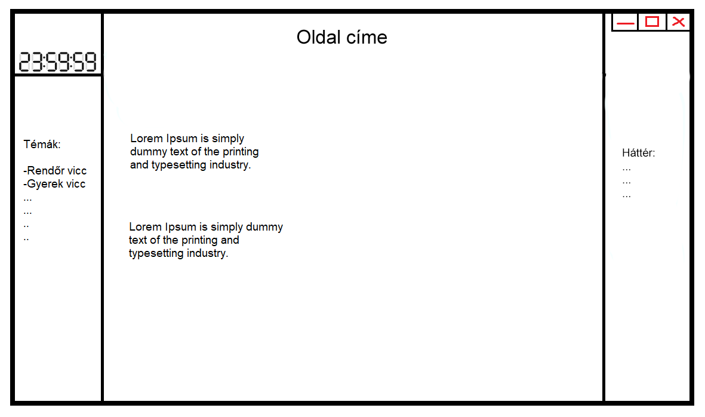

Funkcionális specifikáció
=========================

Áttekintés
----------
Egy olyan weboldalt fejlesztünk, ami segít az embereknek gyors kikapcsolódást nyújtani, valamint a hátteret is testre tudjuk majd szabni. Az oldal ingyenes lesz, és nem fog igényelni regisztrációt.
 
Jelenlegi helyzet
-----------------
Szeretnénk egy olyan weboldalt fejleszteni, ahol az emberek különböző kategóriákba sorolt viccek közül választhatnak és olvashatnak számukra tetsző háttérkép mellett. Ez elérhető lenne több böngészőn.

Követelménylista
----

| ID | Leírás |
|----| ------ |
|F1| A felület lesztul kell, hogy legyen és pár kattíntással ki kell legyen választható a vicc kategóra és jól olvashatóak kell legyenek a viccek.  |
|F2| Az öszzes kategória meg kell hogy jelenjen a kezdő képernyón ahonnan egyszerű kattintással ki lehet majd választani az adott kategóriát. |
|F3| Kell legeyen egy legördülő menü ahol nehány háttérkép közül választhat a felhasználó.|
|F4| A felületen meg kell jelenjen egy óra, hogy mindig tudni lehessen a pontos ídőt..|

Igényelt üzleti folyamatok
----

- A oldalra való belépést követően => a vicc kategóra kiválasztása => a kategóriába tartozó viccek megjelenítése
- A oldalra való belépést követően => a háttér kiválasztása => a megfelel háttér beállítása 

Fogalomtár
---

- HTML: A HTML (angolul: HyperText Markup Language) egy leíró nyelv, melyet weboldalak készítéséhez fejlesztettek ki, és mára már internetes szabvánnyá vált a W3C támogatásával. Az aktuális változata az 5, ezt a verziót használjuk mi is.
- CSS: A CSS (_Cascading  Style  Sheets_) egy stílusleíró nyelv, mely a HTML vagy XHTML típusú strukturált dokumentumok megjelenését írja le. Weblapunk stílusát ezzel készítjük el.
- JavaScript: A JavaScript  programozási nyelv egy objektumorientált, prototípus-alapú szkriptnyelv, amelyet weboldalakon elterjedten használnak. A weblapunk programozásához lesz szükségünk rá.

Képernyő terv
---

