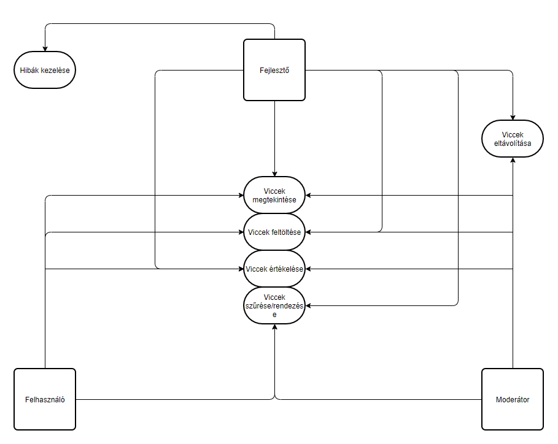

# Rendszerterv

A rendszer célja
---

Jelenleg a interneten és vicc könyvekben rengeteg jó vicc megtalálható, ám ezek megtalálása nem feltétlenül könnyű folyamat. A cél egy olyan weboldal létrehozása amegy bárki számára elérhető a neten. A felhasználó kategóriánként tud keresni a viccek között.

Projektterv
-----------

### Projektszerepkörök, felelőségek:
Scrum master:
Product owner: Ignácz Máté

### Projektmunkások és felelőségek:
#### Backend:
György Dávid, Györke Zsófia, Ignácz Máté, Olasz Zsolt. Feladatuk funkciók létrehozása, adatok tárolása.

#### Frontend:
György Dávid, Györke Zsófia, Ignácz Máté, Olasz Zsolt. Feladatuk a weboldal elemeinek megejelnítése.

### Ütemterv:
| Funkció/Story | Feladat/Task | Prioritás | Becslés | Aktuális becslés | Eltelt idő | Hátralévő idő | 
| -------------- | ----------- | --------- | ------- | ---------------- | ---------- | ------------- |
| Követelmény specifikáció | | 0 | 8 | 8 | 7 | 1 |
| Funkcionális specifikáció | | 0 | 8 | 8 | 7 | 1 |
| Rendszerterv |  | 0 | 8 | 8 | 7 | 1 | 
| Backend | Funckciók/Adattárolás | 2 | 8 | 8 | 0 | 8 |
| Frontend |  Megjelenítés | 2 | 8 | 8 | 0 | 8 |

### Mérföldkövek:
Első heti munka bemutatása elkészült.

Üzleti folyamatok modellje
--------------------------

Követelmények
---
- Viccek tárolása.
- Viccek kategóriába rendezése.
- A GDPR-nek való megfelelés.

Adatbázis terv
---
A viccek tárolása JSON állományokban történik, innen kerülnek beolvasásra a HTML fájlban.

Funkcionális terv
---
Egy olyan weboldalt fejlesztünk, ami segít az embereknek gyors kikapcsolódást nyújtani, egy pontozó rendszer segítségével megtekinthetnek új népszerű vicceket, vagy rendszezhetnek kevésbé nepszerüek szerint. Mások igénybe vehetik, hogy a saját vicceiket osszák meg másokkal. Az oldal ingyenes lesz, és nem fog igényelni regisztrációt.

Fizikai környezet
---
- A viccportál HTML formátumban készült webes felületre, ezáltal a platform operációs rendszere bármi lehet.
- Nincsenek megvásárolt komponenseink
- Fejlesző eszközök:
	- Visual Studio Code Live Server bővítménnyel

Telepítési terv
---
A rendszer nem igényel semmiféle telepítést, böngészőből futtatható a viccportál.

Karbantartási terv
---
A szoftveren havonta tervezünk karbantartásokat végezni, ezen felül bármilyen felhasználói hibajelentést azonnali helyreállítás követ. A szoftveren évente nagyobb frissítések, módosítások várhatók.

Absztrakt domain modell leírása
---
Fogalmak:
-   HTML: A HTML (angolul: HyperText Markup Language) egy leíró nyelv, melyet weboldalak készítéséhez fejlesztettek ki, és mára már internetes szabvánnyá vált a W3C támogatásával. Az aktuális változata az 5, ezt a verziót használjuk mi is.
-   CSS: A CSS (_Cascading Style Sheets_) egy stílusleíró nyelv, mely a HTML vagy XHTML típusú strukturált dokumentumok megjelenését írja le. Weblapunk stílusát ezzel készítjük el.
-   JavaScript: A JavaScript programozási nyelv egy objektumorientált, prototípus-alapú szkriptnyelv, amelyet weboldalakon elterjedten használnak. A weblapunk programozásához lesz szükségünk rá.

Tesztterv
---

A tesztelések célja a rendszer és komponensei funkcionalitásának teljes vizsgálata, ellenőrzése, a rendszer által megvalósított üzleti szolgáltatások verifikálása.

**Manuális teszt:**

##### Óra

Elvárt viselkedés: Az óra a pontos időt mutatja, és folyamatosan frissül.

##### Kezdőlap

Elvárt viselkedés: A kezdőlap szövegre kattintva az oldal betölti a kazdolap.json tartalmát, és megváltozatja az oldal címét kezdőlapra.

##### Rendőr viccek

Elvárt viselkedés: A rendőr viccek szövegre kattintva az oldal betölti a rendorviccek.json tartalmát, és megváltoztatja az oldal címét rendőr viccekre.

##### Gyerek viccek

Elvárt viselkedés: A gyerek viccek szövegre kattintva az oldal betölti a gyerekviccek.json tartalmát, és megváltoztatja az oldal címét gyerek viccekre.

##### Állatos viccek

Elvárt viselkedés: Az állatos viccek szövegre kattintva az oldal betölti a allatosviccek.json tartalmát, és megváltoztatja az oldal címét állatos viccekre.

##### Skót viccek

Elvárt viselkedés: Az skót viccek szövegre kattintva az oldal betölti a skotviccek.json tartalmát, és megváltoztatja az oldal címét állatos viccekre.

##### Éjszaka háttér

Elvárt viselkedés: A lenyílómenüből kiválasztva az éjszaka hátteret és a beállít gombra kattintva a háttér megváltozik a megfelelő háttére, és a szöveg jól olvasható.

##### Tenger háttér

Elvárt viselkedés: A lenyílómenüből kiválasztva az tenger hátteret és a beállít gombra kattintva a háttér megváltozik a megfelelő háttére, és a szöveg jól olvasható.

##### Hegyek háttér

Elvárt viselkedés: A lenyílómenüből kiválasztva az hegyek hátteret és a beállít gombra kattintva a háttér megváltozik a megfelelő háttére, és a szöveg jól olvasható.

##### Dombok háttér

Elvárt viselkedés: A lenyílómenüből kiválasztva az dombok hátteret és a beállít gombra kattintva a háttér megváltozik a megfelelő háttére, és a szöveg jól olvasható.

**Unite teszt:**

Ahol csak lehetséges, szükséges már a fejlesztési idő alatt is tesztelni, hogy a metódusok megfelelően működnek-e. Ezért a metódusok megfelelő működésének biztosítására mindegyikhez írni kell Unit teszteket, a minél nagyobb kódlefedettséget szem előtt tartva. A metódusok akkor vannak kész, ha a tesztesetek hiba nélkül lefutnak az egyes metódusokon.

**Alfa teszt:**

A teszt elsődleges célja: az eddig meglévő funkcióknak a különböző böngészőkkel, és androidokkal való kompatibilitásának tesztelése. A tesztet a fejlesztők végzik. Az eljárás sikeres, ha különböző böngészőkben is megfelelően működnek a különböző funkciók.  A teszt időtartama egy hét.
